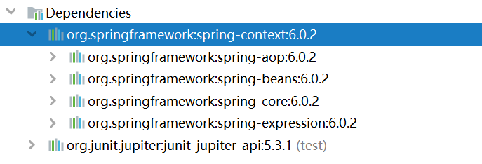
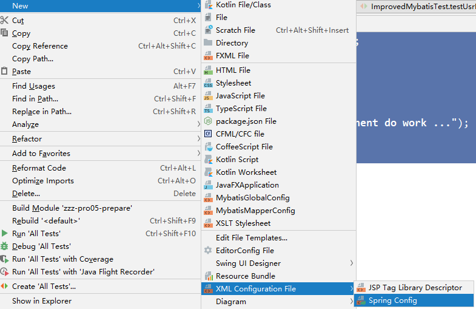
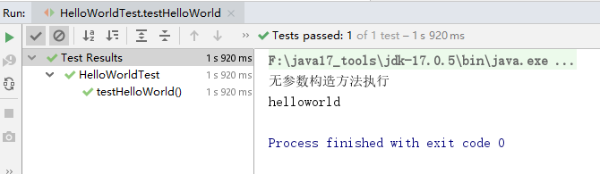

# 2、入门

## 2.1、环境要求
- JDK：Java17+ **（Spring6要求JDK最低版本是Java17）**
- Maven：3.6+
- Spring：6.0.2


## 2.2、构建模块

### （1）构建父模块spring6
在idea中，依次单击 File -> New -> Project -> New Project


点击“Create”


删除src目录

### （2）构建子模块spring6-first


点击 Create 完成


## 2.3、程序开发

### 2.3.1、引入依赖
**添加依赖：**
```xml
<dependencies>
    <!--spring context依赖-->
    <!--当你引入Spring Context依赖之后，表示将Spring的基础依赖引入了-->
    <dependency>
        <groupId>org.springframework</groupId>
        <artifactId>spring-context</artifactId>
        <version>6.0.2</version>
    </dependency>

    <!--junit5测试-->
    <dependency>
        <groupId>org.junit.jupiter</groupId>
        <artifactId>junit-jupiter-api</artifactId>
        <version>5.3.1</version>
    </dependency>
</dependencies>
```

**查看依赖：**


### 2.3.2、创建java类
```java
package com.atguigu.spring6.bean;

public class HelloWorld {

    public void sayHello() {
        System.out.println("helloworld");
    }
}
```

### 2.3.3、创建配置文件
在resources目录创建一个 Spring 配置文件 beans.xml（配置文件名称可随意命名，如： springs.xml）


```xml
<?xml version="1.0" encoding="UTF-8"?>
<beans xmlns="http://www.springframework.org/schema/beans"
       xmlns:xsi="http://www.w3.org/2001/XMLSchema-instance"
       xsi:schemaLocation="http://www.springframework.org/schema/beans http://www.springframework.org/schema/beans/spring-beans.xsd">

    <!--
    配置HelloWorld所对应的bean，即将HelloWorld的对象交给Spring的IOC容器管理
    通过bean标签配置IOC容器所管理的bean
    属性：
        id：设置bean的唯一标识
        class：设置bean所对应类型的全类名
    -->
    <bean id="helloWorld" class="com.atguigu.spring6.bean.HelloWorld"></bean>

</beans>
```

### 2.3.4、创建测试类测试
```java
package com.atguigu.spring6.bean;

import org.junit.jupiter.api.Test;
import org.springframework.context.ApplicationContext;
import org.springframework.context.support.ClassPathXmlApplicationContext;

public class HelloWorldTest {

    @Test
    public void testHelloWorld() {
        ApplicationContext ac = new ClassPathXmlApplicationContext("beans.xml");
        HelloWorld helloworld = (HelloWorld) ac.getBean("helloWorld");
        helloworld.sayHello();
    }
}
```

### 2.3.5、运行测试程序


## 2.4、程序分析

### 1. 底层是怎么创建对象的，是通过反射机制调用无参数构造方法吗？
修改HelloWorld类：
```java
package com.atguigu.spring6.bean;

public class HelloWorld {

    public HelloWorld() {
        System.out.println("无参数构造方法执行");
    }

    public void sayHello() {
        System.out.println("helloworld");
    }
}
```

执行结果：


**测试得知：创建对象时确实调用了无参数构造方法。**

### 2. Spring是如何创建对象的呢？原理是什么？
```java
// dom4j解析beans.xml文件，从中获取class属性值，类的全类名
// 通过反射机制调用无参数构造方法创建对象
Class clazz = Class.forName("com.atguigu.spring6.bean.HelloWorld");
// Object obj = clazz.newInstance();
Object object = clazz.getDeclaredConstructor().newInstance();
```

### 3. 把创建好的对象存储到一个什么样的数据结构当中了呢？
bean对象最终存储在spring容器中，在spring源码底层就是一个map集合，存储bean的map在**DefaultListableBeanFactory**类中：
```java
private final Map<String, BeanDefinition> beanDefinitionMap = new ConcurrentHashMap<>(256);
```

Spring容器加载到Bean类时，会把这个类的描述信息，以包名加类名的方式存到beanDefinitionMap中，
`Map<String, BeanDefinition>` ，其中String是key，默认是类名首字母小写，
BeanDefinition，存的是类的定义(描述信息)，我们通常叫BeanDefinition接口为：bean的定义对象。


## 2.5、启用Log4j2日志框架

### 2.5.1、Log4j2日志概述
在项目开发中，日志十分的重要，不管是记录运行情况还是定位线上问题，都离不开对日志的分析。日志记录了系统行为的时间、地点、状态等相关信息，能够帮助我们了解并监控系统状态，在发生错误或者接近某种危险状态时能够及时提醒我们处理，同时在系统产生问题时，能够帮助我们快速的定位、诊断并解决问题。

**Apache Log4j2**是一个开源的日志记录组件，使用非常的广泛。在工程中以易用方便代替了 System.out 等打印语句，它是JAVA下最流行的日志输入工具。

**Log4j2主要由几个重要的组件构成：**
1. **日志信息的优先级**，日志信息的优先级从高到低有**TRACE < DEBUG < INFO < WARN < ERROR < FATAL**
   - TRACE：追踪，是最低的日志级别，相当于追踪程序的执行
   - DEBUG：调试，一般在开发中，都将其设置为最低的日志级别
   - INFO：信息，输出重要的信息，使用较多
   - WARN：警告，输出警告的信息
   - ERROR：错误，输出错误信息
   - FATAL：严重错误

   这些级别分别用来指定这条日志信息的重要程度；级别高的会自动屏蔽级别低的日志，也就是说，设置了WARN的日志，则INFO、DEBUG的日志级别的日志不会显示
2. **日志信息的输出目的地**，日志信息的输出目的地指定了日志将打印到**控制台**还是**文件中**；
3. **日志信息的输出格式**，而输出格式则控制了日志信息的显示内容。

### 2.5.2、引入Log4j2依赖
```xml
<!--log4j2的依赖-->
<dependency>
    <groupId>org.apache.logging.log4j</groupId>
    <artifactId>log4j-core</artifactId>
    <version>2.19.0</version>
</dependency>
<dependency>
    <groupId>org.apache.logging.log4j</groupId>
    <artifactId>log4j-slf4j2-impl</artifactId>
    <version>2.19.0</version>
</dependency>
```

### 2.5.3、加入日志配置文件
在类的根路径下提供log4j2.xml配置文件（文件名固定为：log4j2.xml，文件必须放到类根路径下。）
```xml
<?xml version="1.0" encoding="UTF-8"?>
<configuration>
    <loggers>
        <!--
            level指定日志级别，从低到高的优先级：
                TRACE < DEBUG < INFO < WARN < ERROR < FATAL
                trace：追踪，是最低的日志级别，相当于追踪程序的执行
                debug：调试，一般在开发中，都将其设置为最低的日志级别
                info：信息，输出重要的信息，使用较多
                warn：警告，输出警告的信息
                error：错误，输出错误信息
                fatal：严重错误
        -->
        <root level="DEBUG">
            <appender-ref ref="spring6log"/>
            <appender-ref ref="RollingFile"/>
            <appender-ref ref="log"/>
        </root>
    </loggers>

    <appenders>
        <!--输出日志信息到控制台-->
        <console name="spring6log" target="SYSTEM_OUT">
            <!--控制日志输出的格式-->
            <PatternLayout pattern="%d{yyyy-MM-dd HH:mm:ss SSS} [%t] %-3level %logger{1024} - %msg%n"/>
        </console>

        <!--文件会打印出所有信息，这个log每次运行程序会自动清空，由append属性决定，适合临时测试用-->
        <File name="log" fileName="d:/spring6_log/test.log" append="false">
            <PatternLayout pattern="%d{HH:mm:ss.SSS} %-5level %class{36} %L %M - %msg%xEx%n"/>
        </File>

        <!-- 这个会打印出所有的信息，
            每次大小超过size，
            则这size大小的日志会自动存入按年份-月份建立的文件夹下面并进行压缩，
            作为存档-->
        <RollingFile name="RollingFile" fileName="d:/spring6_log/app.log"
                     filePattern="log/$${date:yyyy-MM}/app-%d{MM-dd-yyyy}-%i.log.gz">
            <PatternLayout pattern="%d{yyyy-MM-dd 'at' HH:mm:ss z} %-5level %class{36} %L %M - %msg%xEx%n"/>
            <SizeBasedTriggeringPolicy size="50MB"/>
            <!-- DefaultRolloverStrategy属性如不设置，
            则默认为最多同一文件夹下7个文件，这里设置了20 -->
            <DefaultRolloverStrategy max="20"/>
        </RollingFile>
    </appenders>
</configuration>
```

### 2.5.4、测试
运行原测试程序


运行原测试程序，多了spring打印日志

### 2.5.5、使用日志
```java
public class HelloWorldTest {

    private Logger logger = LoggerFactory.getLogger(HelloWorldTest.class);

    @Test
    public void testHelloWorld() {
        ApplicationContext ac = new ClassPathXmlApplicationContext("beans.xml");
        HelloWorld helloworld = (HelloWorld) ac.getBean("helloWorld");
        helloworld.sayHello();
        logger.info("执行成功");
    }
}
```

控制台：


