入门案例分析
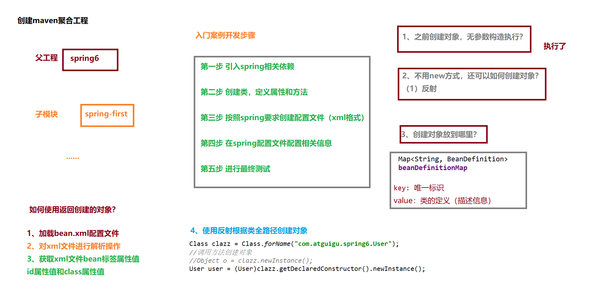

IoC容器

IoC容器（di和BeanFactory工厂）
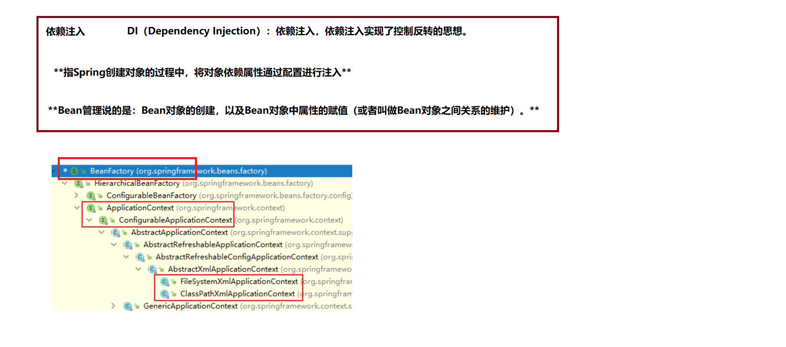

获取bean扩展
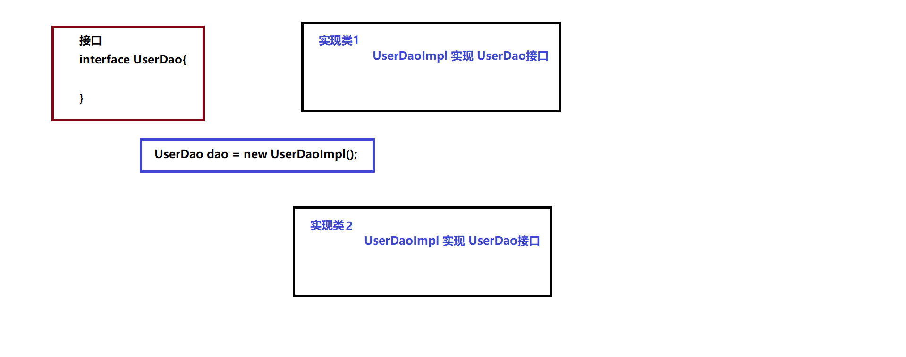

依赖注入两种方式
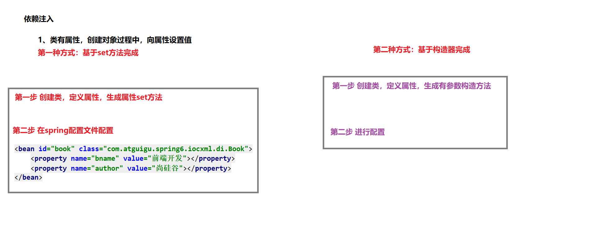

特殊类型属性注入
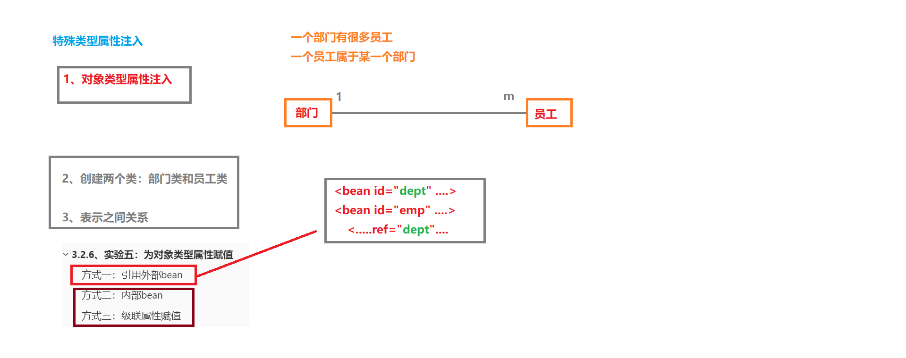

对象类型属性注入（外部bean）
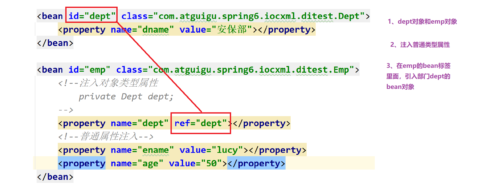

引入外部属性文件
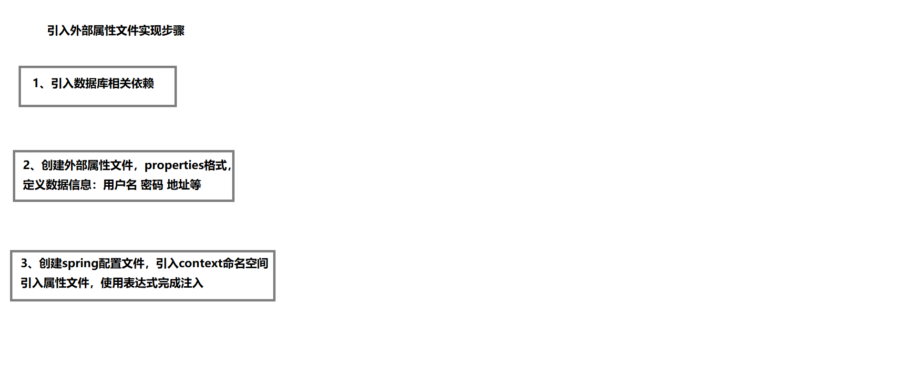

bean生命周期
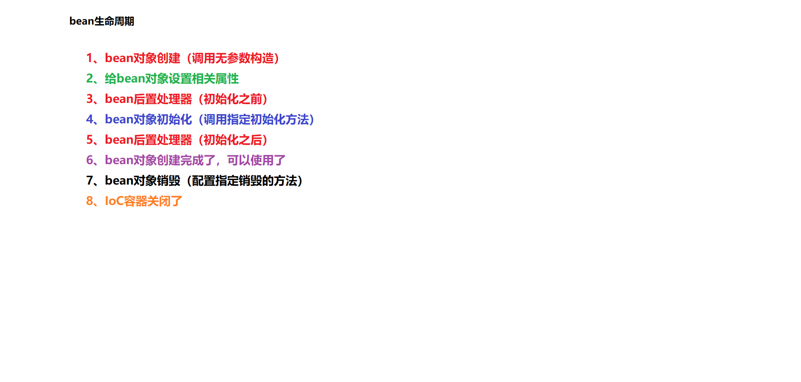

自动装配
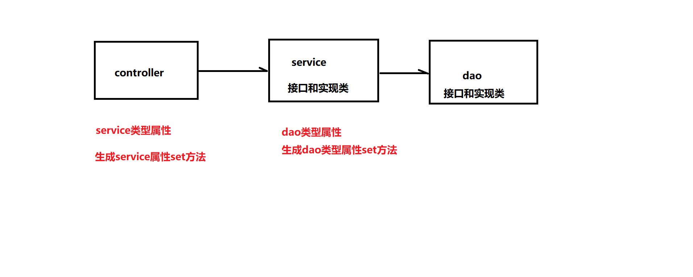

autowired注入
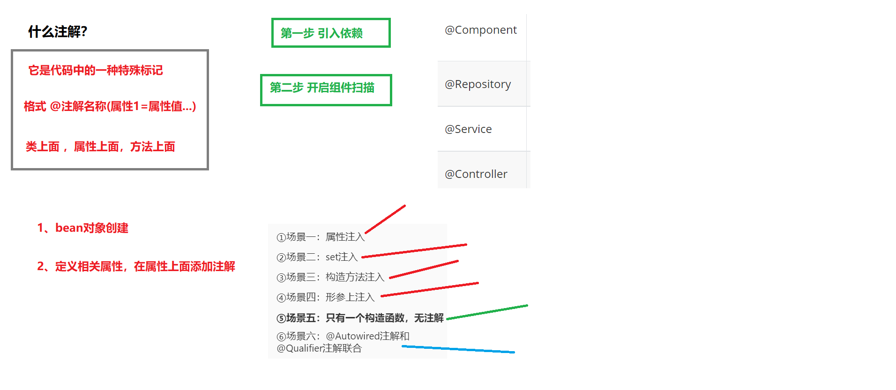

Resource注入1
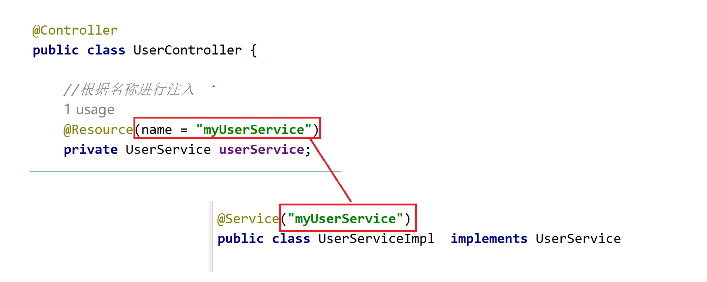

Resource注入2

手写spring-bean创建分析
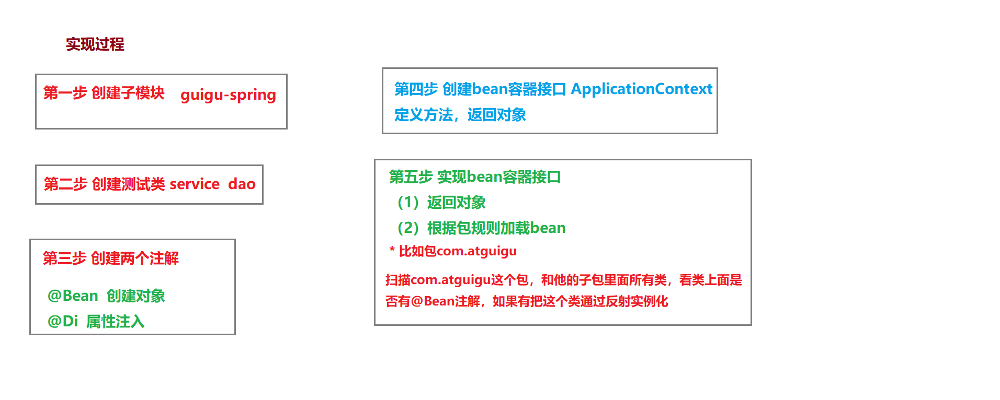

动态代理分类
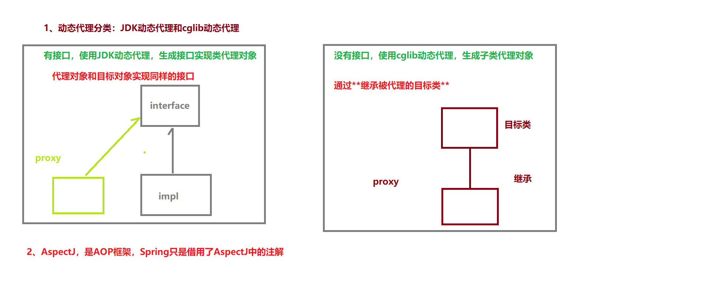

用户买书案例分析
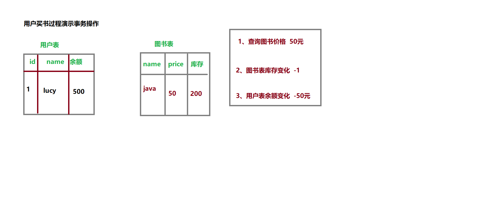

演示事务传播行为
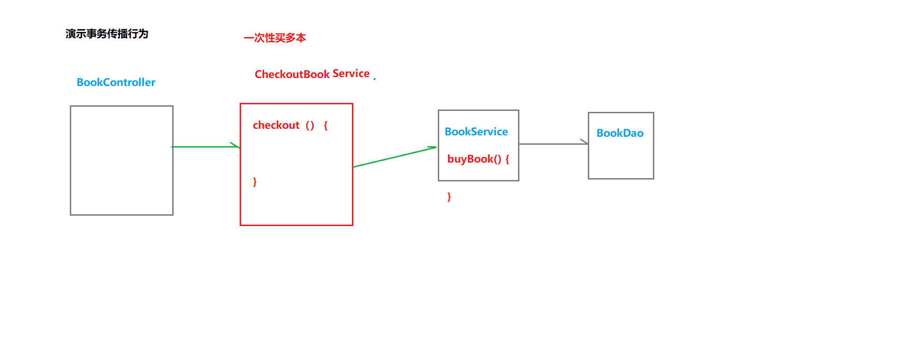

设置事务相关属性为
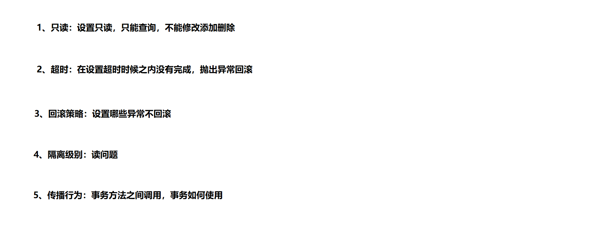

基于xml声明式事务
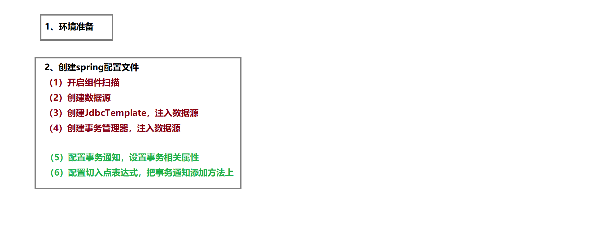

AOT概述
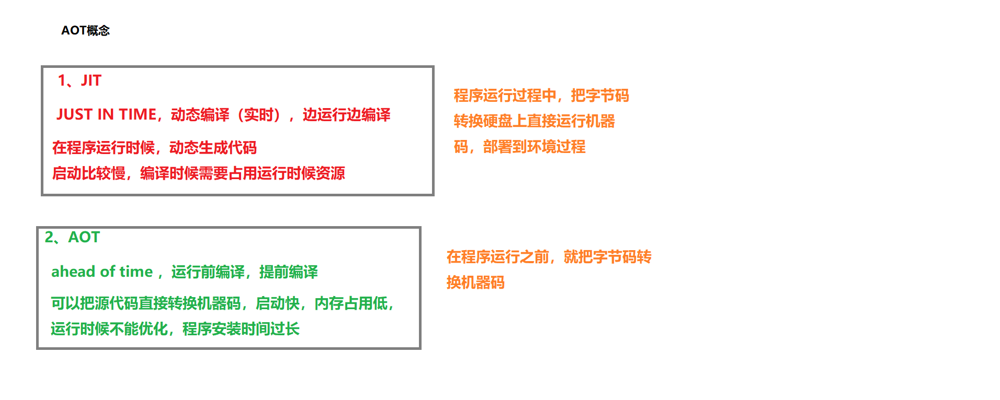

native image构建

